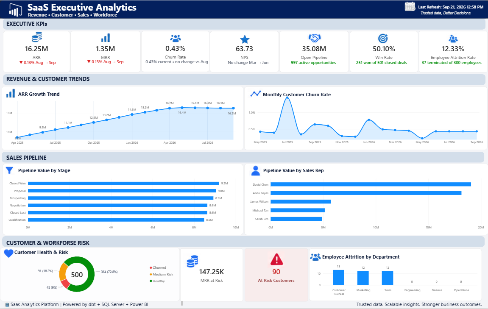

# SaaS Executive Analytics - Power BI Portfolio

A portfolio case study demonstrating end-to-end business intelligence delivery in Power BI: KPI definition, data modeling, DAX, executive visualization, validation, and decision support.

**Architecture:** dbt + SQL Server + Power BI

## Executive Overview

The dashboard consolidates several SaaS operating domains into a single executive view:

- **Revenue:** ARR, MRR, period-over-period change, and revenue trend
- **Customer health:** churn rate, at-risk customers, MRR at risk, health distribution, and NPS context
- **Sales:** win rate, open pipeline, pipeline by stage, and pipeline by sales representative
- **Workforce:** employee attrition rate and attrition by department
- **Data operations:** last-refresh visibility for reporting confidence

The goal is to give leadership a concise, decision-ready view of company performance without requiring separate operational reports.

## Dashboard Design

The current PBIX contains an **Executive Overview** page with KPI cards and analytical visuals covering ARR, MRR, monthly customer churn, customer health, customer risk, NPS, win rate, open pipeline, sales pipeline, employee attrition, and trend analysis.

## Data Model

The report references analytical marts for executive KPIs, monthly revenue, customer health, sales pipeline, workforce, and refresh information. This separation supports a reporting-oriented model where curated analytical datasets feed reusable executive measures and visuals.

## Skills Demonstrated

**Power BI | DAX | Power Query | Data Modeling | SQL | KPI Design | Data Visualization | Business Analysis | Data Validation | Executive Reporting**

## Portfolio Safety

The public portfolio should contain only synthetic, sanitized, or non-confidential data. Employer/client datasets, credentials, connection strings, personally identifiable information, and proprietary source-system information should not be published.

## Repository Structure

- `screenshots/` - exported dashboard images
- `pbix/` - sanitized Power BI Desktop files
- `sample-data/` - synthetic or sanitized datasets
- `documentation/` - requirements, DAX, and data-model documentation

## About

Created by **Jun Daig** as part of a portfolio spanning business intelligence, data analytics, systems analysis, full-stack development, and workflow automation.
